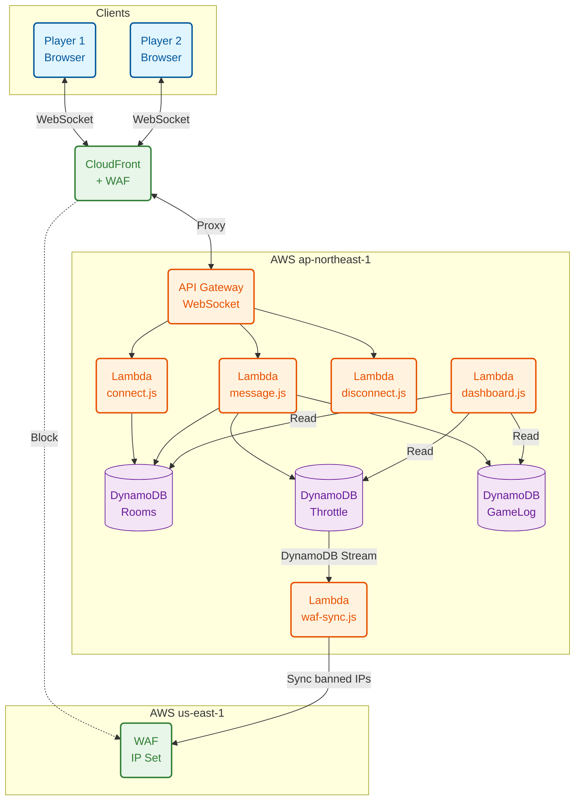

# PENGUIN BATTLE! - Online PvP

**ペンギンが殴り合う。ただそれだけ。でもそれがいい。**

ブラウザだけで遊べるリアルタイム対戦格闘ゲーム。ペンギン同士が SLAP / STRIKE / GUARD の三すくみで戦う、シンプルだけど読み合いが熱いやつ。

アプリ不要。URL 共有するだけ。スマホでもPCでも。

---

## 遊ぶ

**https://oneliner22.github.io/penguin-battle/pvp/**

1. 1人目が **「ルーム作成」** → 6文字のコードが出る
2. コードを相手に送る（LINE, Discord, 口頭、なんでも）
3. 2人目がコードを入力して **「参加」**
4. 殴れ

## ルール

3つの攻撃による **じゃんけん方式** の読み合いバトル:

| 攻撃 | 勝てる相手 | 説明 |
|------|-----------|------|
| **SLAP** | > GUARD | ガードを貫通する |
| **STRIKE** | > SLAP | 高ダメージを叩き込む |
| **GUARD** | > STRIKE | 防御して反撃する |

- 制限時間 **60秒**
- 相手のHPを 0 にするか、タイムアップ時にHPが多い方が勝ち
- 移動で間合いを調整、攻撃のタイミングと種類を読み合う

## 操作

| | PC (キー1) | PC (キー2) | スマホ |
|---|---|---|---|
| 移動 | ← → | A D | 十字キー (画面左) |
| ジャンプ | ↑ | W | 十字キー上 |
| SLAP | Z | J | SLAP ボタン |
| STRIKE | X | K | STRIKE ボタン |
| GUARD | C | L | GUARD ボタン |

> 対戦中は画面左上の **「Keys」** ボタンからいつでもキーバインドを確認できます。

---

## アーキテクチャ



### 技術スタック

| レイヤー | 技術 |
|---------|------|
| フロントエンド | HTML5 Canvas + Vanilla JS (単一HTMLファイル) |
| 通信 | WebSocket (API Gateway) |
| エッジ | CloudFront + AWS WAF |
| バックエンド | AWS Lambda (Node.js 20.x) |
| データストア | DynamoDB (PAY_PER_REQUEST) |
| IaC | CloudFormation (2スタック: ap-northeast-1 + us-east-1) |

### セキュリティ

- **レート制限**: 接続数・メッセージ頻度のスロットリング
- **IP自動BAN**: 異常アクセス検知 → DynamoDB → WAF IP Set 自動同期
- **エッジブロック**: CloudFront + WAF で BAN済みIPをLambda到達前に遮断
- **ルームコード認証**: 6文字ランダムコード (紛らわしい文字除外)

---

## ディレクトリ構成

```
penguin-battle/
├── pvp/
│   └── index.html          # ゲーム本体 (PvP対戦)
├── mobile/
│   └── index.html          # モバイル版 (ローカル1人用)
├── index.html              # PC版 (ローカル1人用)
├── admin-dashboard.html    # 管理ダッシュボード (ローカル専用)
├── pvp_architecture.html   # アーキテクチャ図 (Mermaid)
├── server/
│   ├── template.yaml       # CloudFormation (メインスタック)
│   ├── template-waf.yaml   # CloudFormation (WAFスタック: us-east-1)
│   ├── deploy.ps1          # デプロイスクリプト
│   └── src/
│       ├── connect.js      # WebSocket接続ハンドラ
│       ├── message.js      # ゲームロジック + 状態管理
│       ├── disconnect.js   # 切断ハンドラ
│       ├── dashboard.js    # 管理API (IPホワイトリスト)
│       └── waf-sync.js     # DynamoDB Stream → WAF IP Set 同期
└── README.md
```

---

## デプロイ

```powershell
# server/deploy.ps1 を編集:
# - $ADMIN_IPS にダッシュボード許可IPを設定

cd server
.\deploy.ps1
```

3段階デプロイ:
1. **メインスタック** (ap-northeast-1) — API Gateway, Lambda, DynamoDB
2. **WAFスタック** (us-east-1) — CloudFront, WAF, IP Set
3. **メインスタック更新** — WAF設定の反映 + Lambda コード更新

---

## ライセンス

MIT
